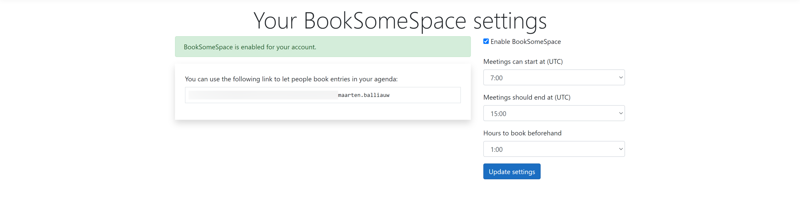
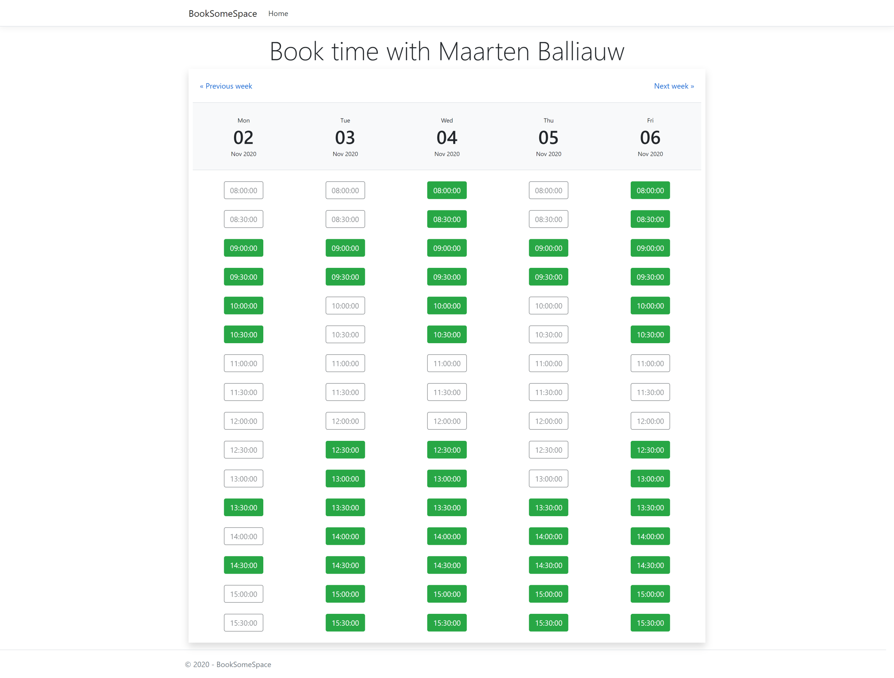

# BookSomeSpace

BookSomeSpace helps you schedule meetings. It eliminates back and forth emails - people can book straight into your calendar!

## Screenshots

Before your agenda is available for booking, you will have to enable BookSomeSpace:



People can then book time in your agenda:



## Setting up for development

You will need an application registered in Space.
* [Create a new Server-side Web App](https://www.jetbrains.com/help/space/applications.html#register-your-client-in-space)
  * Callback URL: `https://localhost:5001/signin-space`
* Copy the client id and client secret into `appsettings.json`
  * Create a [user secrets file](https://docs.microsoft.com/en-us/aspnet/core/security/app-secrets):
    * Windows - `%APPDATA%\Microsoft\UserSecrets\BookSomeSpace\secrets.json`
    * Linux/macOS - `~/.microsoft/usersecrets/BookSomeSpace/secrets.json`

Example `secrets.json`:
```
{
  "Space": {
    "ServerUrl": "https://{organization}.jetbrains.space",
    "ClientId": "{client-id}",
    "ClientSecret": "{client-secret}"
  }
}
```

## Try it out!

Once up-and-running, you can use the following URLs:

* https://localhost:5001/Enable - Enables the calendar booking for your account
* https://localhost:5001/Space.Username - Book in `Space.Username` calendar